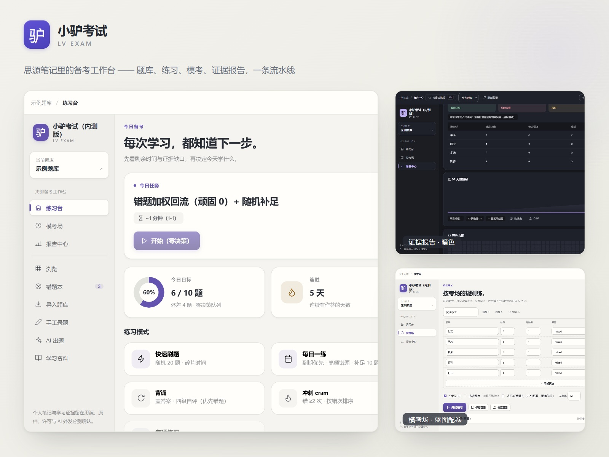
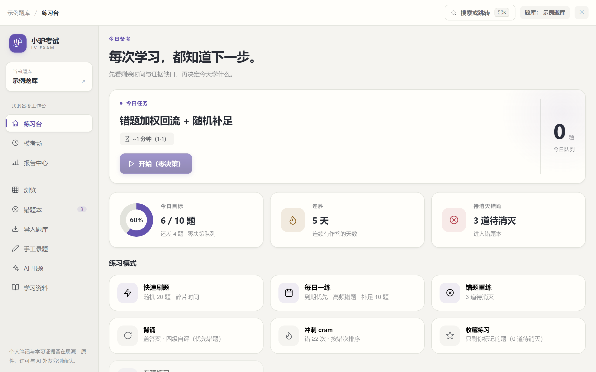
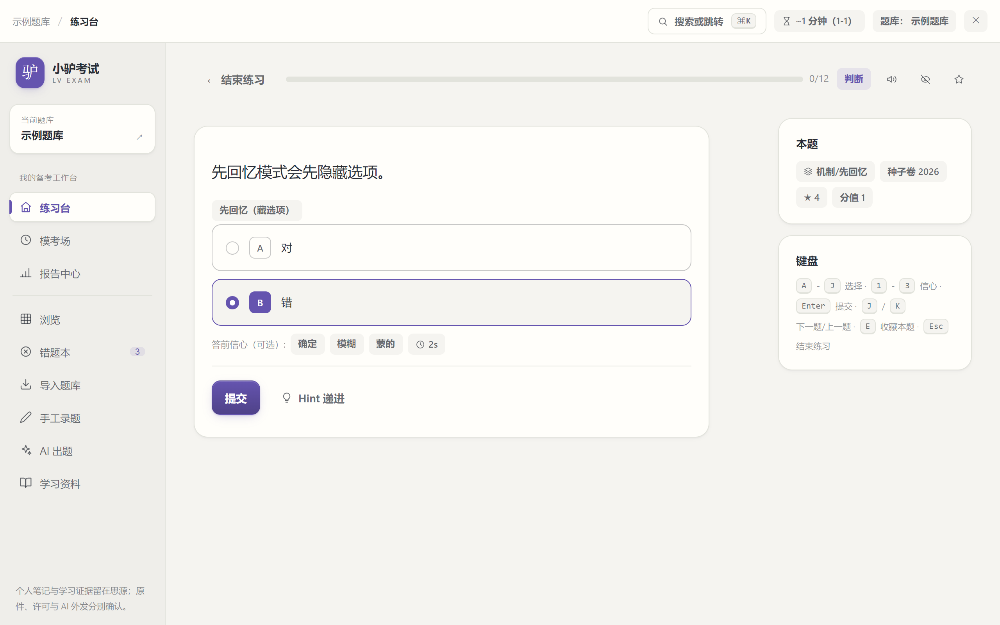
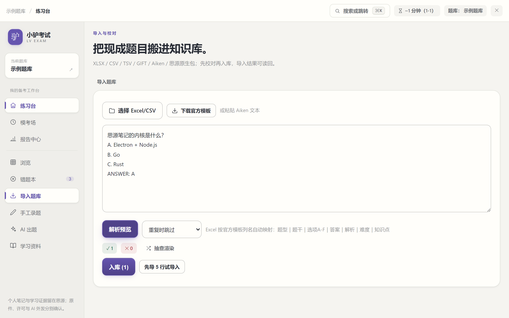
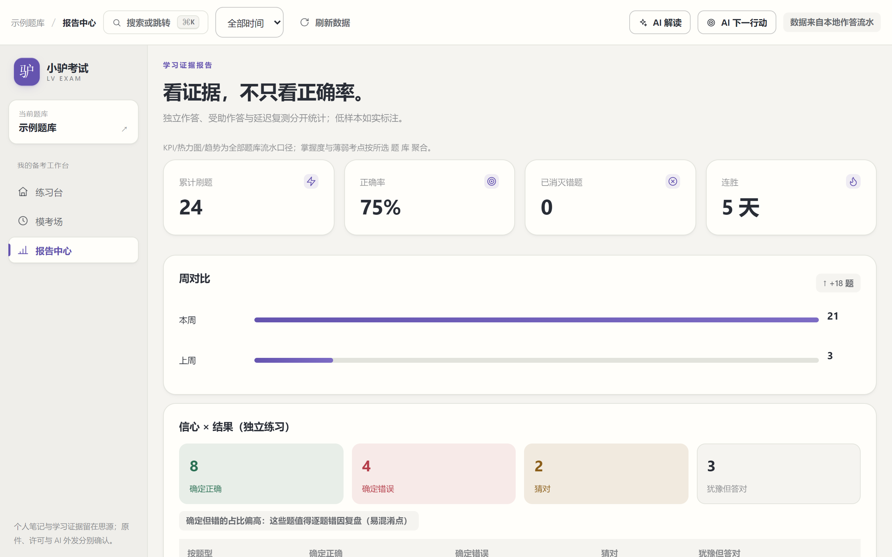
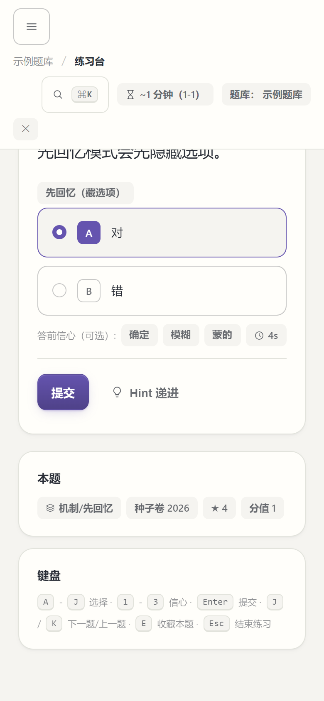

# 小驴考试（内测版）

> **内测说明：** 小驴考试仍处于内测阶段，功能和界面会持续调整，部分能力尚未完成真实思源环境或大题库验证。请先用自有或获准的小样例试用，并为重要资料保留备份。欢迎加入交流 QQ 群 **871707735** 反馈 Bug、提交需求和交流使用体验。

**思源笔记上的本地优先备考工作台：AI 辅助整理与复盘，学习过程和证据可追溯。**

小驴考试（内测版）面向使用思源笔记的自主备考者，把自己的题目、资料、作答与反思连接起来：看清还缺什么，选择下一步练习，再用独立作答与延迟复测检查理解，留下可复用的个人知识。

**用户资料 → 独立作答 → 复盘行动 → 复测 → 个人知识库**

[](https://github.com/ai68298100/siyuan-exam/releases)
[](https://github.com/ai68298100/siyuan-exam/actions/workflows/check.yml)
[](#开发)
[](https://github.com/siyuan-note/siyuan)
[](LICENSE)

[English](README.en-US.md) · [当前状态](docs/STATUS.md) · [贡献指南](CONTRIBUTING.md) · [安全报告](SECURITY.md) · [下载发行包](https://github.com/ai68298100/siyuan-exam/releases) · [查看 UI 设计原型](design/prototype/index.html) · [反馈问题](https://github.com/ai68298100/siyuan-exam/issues) · [参与讨论](https://github.com/ai68298100/siyuan-exam/discussions)

## 本次更新：v0.9.5 → v0.9.6（2026-10-10）

本次完善首次使用引导、空态与错误反馈，并打通练习台、模考场和报告中心的题目交接与数据刷新。

- **新增：** 新用户三步引导、题库空态、读取失败重试和按钮前置条件说明。
- **优化：** 薄弱考点组卷、行动重练和模考错题回炉统一携带题库上下文；报告支持刷新并自动同步新结算数据。
- **修复：** 已打开练习台无法接管外部新会话、题库切换迟到响应覆盖当前视图等问题。
- **验证：** `pnpm check`、`pnpm test`、`pnpm lint`、`pnpm build`、`pnpm verify:package`、`pnpm smoke:ui` 全部通过。

<details>
<summary>查看更早版本更新（v0.9.5 及之前）</summary>

### v0.9.5 · 自定义页签稳定性

修复思源打开自定义页签时因序列化插件实例而报循环引用错误，并统一模考、报告页内的练习台跳转入口。

### v0.9.4 · 集市上架准备

将预览图缩至 1600×1200 的 JPEG，并同步清单、README 和发行包校验，符合集市图片大小限制。

### v0.9.3 · 模考记录与状态反馈

完善模考快照顺序写入与交卷重试，校验估分输入，并补齐忙碌/只读状态、空态和错误提示。

### v0.9.1 · 内测品牌与文档

统一插件名称为「小驴考试（内测版）」，补充系列插件索引、QQ 群和内测说明，并同步宿主显示名、界面品牌与导出名称。集市上架继续暂缓。

### v0.9.0 · 界面与交互

对齐设计规范 v6 的动效、焦点和主题色；修复报告图表、错因统计与暗色热力图；收敛浏览工具栏、区分首页练习模式层级、补齐命令面板模式入口，并更新品牌图标和预览图。

更早版本及完整变更记录见 [CHANGELOG.md](CHANGELOG.md)。
</details>

## 小驴系列插件与交流

欢迎交流反馈：**QQ 群 871707735**，可用于反馈 Bug、提交需求和交流使用体验。

| 插件名称           | 一句话简介                                                         | GitHub 仓库                                                 |
| ------------------ | ------------------------------------------------------------------ | ----------------------------------------------------------- |
| 小驴雷切           | 思源中的统一导航与工作上下文平台，支持页签、收藏、搜索和快捷入口。 | [GitHub](https://github.com/ai68298100/siyuan-speed-switch) |
| 小驴打卡           | 本地优先的习惯与目标打卡工作台，支持分组、统计和复盘。             | [GitHub](https://github.com/ai68298100/siyuan-checkin)      |
| 小驴人脉           | 在思源中管理联系人、关系、组织归属和重要日期。                     | [GitHub](https://github.com/ai68298100/siyuan-contacts)     |
| 小驴拾遗           | 整理思源剪藏和导入文章，支持分拣、阅读与回顾。                     | [GitHub](https://github.com/ai68298100/siyuan-glean)        |
| 小驴考试（内测版） | 本地题库备考工作台，支持导入、刷题、模考、错题复盘与 AI 辅助。     | [GitHub](https://github.com/ai68298100/siyuan-exam)         |
| 小驴管家（内测版） | 管理家庭与生活资料、成员档案、到期提醒和事务跟进。                 | [GitHub](https://github.com/ai68298100/siyuan-home)         |
| 小驴闪卡（内测版） | 基于思源原生 FSRS 的闪卡学习与复习平台。                           | [GitHub](https://github.com/ai68298100/siyuan-lv-cards)     |
| 小驴常用（内测版） | 基于思源文档与块保存、搜索并快速调用常用内容。                     | [GitHub](https://github.com/ai68298100/xiaolv-common)       |



## 界面一览

**练习台 · 今日驾驶舱**（目标环 / 连胜 / 待消灭错题，模式分两级）　**独立作答 · 键盘优先**（A-J 选择、Enter 提交、错因 1-3）

<p>
  
  
</p>

**导入与校对 · 先预览再入库**　**学习证据报告 · 独立/受助/延迟分口径**

<p>
  
  
</p>

<p align="center">
  <br/>
  <sup>窄屏（390px）：作答、选项与键盘提示完整可用</sup>
</p>

## 围绕你的备考流程

这条完整流程是产品设计主线，正在分阶段建设。适合希望把课程或考证资料与思源笔记一起使用的人，也保留题库作者整理、审校和修订内容的方向。

1. **明确这次学什么。** 在项目中选择考试、科目、范围与可用时间，知道今天可以完成哪些任务。学校课程、CET/KET、法考、CPA、CFA 等按不同配置研究，具体支持范围以验收结果为准。
2. **带入自己有权使用的资料。** 可以是题目、笔记、讲义、PDF 或课程视频。先读/看和记笔记，再决定哪些页、片段或题目进入练习；资料不必一进来就变成题库。
3. **用 AI 减少整理成本。** 从所选资料整理范围、提出待审题或修复建议，保留依据与未知项。你核对之后再使用，AI 生成不等于正确答案或官方题目。
4. **先独立作答，再按需要获得帮助。** 练习、背诵、复测与模考有各自条件；使用提示、看过解析或读过脚本应留下帮助记录，便于区分独立完成与受助完成。
5. **把错题变成一个下一行动。** 提交后对照依据讲解，结合自己的思路检查错因，选择补笔记、重做、延迟复测或转为内核闪卡。AI 可以提出假设，实际行动由你选择。
6. **保留理解与证据。** 题目关联资料位置，个人反思与 AI 解释分别保存。报告说明范围、样本与缺失；退出或迁移时，清楚哪些个人记录和获准内容可以带走。

## AI 在各个环节做什么

AI 用于辅助资料整理、练习提示和复盘。现有任务包括出题生成/复核/修复、分层提示、苏格拉底追问、提交后讲解、错因假设、报告解读、下一行动草稿与闪卡候选；请求会经过上下文、预算和使用条件检查，并记录任务结果。下表中尚未实现的跨模块能力仍单独标注。

| 环节       | AI 协作目标                                      | 用户保留的判断与动作                   |
| ---------- | ------------------------------------------------ | -------------------------------------- |
| 资料与题库 | 整理所选片段、提示识别歧义、生成有出处的题目候选 | 对照原件，确认范围、答案与转换损失     |
| 练习与理解 | 一次一层提示、根据思路追问、提交后给依据讲解     | 自己作答，选择帮助层级，核对争议答案   |
| 错题与复测 | 提出错因假设、最小闪卡或变式候选                 | 验证错因，选择下一行动和复测条件       |
| 报告与计划 | 解释已有统计、在分钟预算内提出行动草稿           | 不把 AI 解释当分数或通过预测，确认计划 |
| 个人知识   | 整理反思、来源与 AI 补充的笔记草稿               | 预览差异、选择位置，确认后保存         |

**模型使用与智能体接入是两件事。** 当前代码可使用你在思源中配置的模型，也可自配 OpenAI 兼容端点；思源 AI 需要已启用并配置可用模型。计划进一步把小驴考试（内测版）的业务能力提供给思源智能体，让自然语言入口与普通界面共用任务、上下文和预览服务。这项能力尚未注册，也未完成真机验证。

内置提示词按任务、考试/学科和媒体类型细化，提供缺依据、来源冲突、提示揭示与人工审校的处理规则；可选思源专用技能载体仍待接入。完整正文见 [AI 智能体与提示词模板规范](docs/18-AI智能体与提示词模板规范.md)。模板写好不代表模型质量已经验证。

AI 只产生候选与解释，不应直接改原答案、正式成绩、题源许可或 FSRS 自评。内核代理也不代表本地推理或免费服务；预算、离线、拒绝外发和停用 AI 都需要相应手工路径。

## 资料、PDF、视频与可选工具

**基础资料管理已交付，深度集成仍在规划。** 可登记 PDF、音视频和网页链接，记录页码/时间点/引文位置，添加个人笔记并关联题目；资料可登记为链接，复制到思源 assets 的文件上限为 30 MB。OCR、字幕转写、片段 AI、原文件编辑、网盘授权 API 和目录观察尚未交付。

资料对象与存放位置分别记录：同一资料可有多个位置但学习记录只有一条。个人批注与笔记与原件分开存储，删除批注不动原文件；原文件能否修改取决于工具与权限。

最低路径优先复用思源原生或系统阅读器/播放器，支持打开来源、手工记录位置、编辑自己的笔记。OCR、字幕转写、片段 AI、原文件编辑和网盘授权 API 分别增加，基础查看与笔记不等待它们全部完成。

思阅、思播、思盘以及本地软件按具体版本和公开接口研究；无法定位或回传时，提供手工页码/时间点与返回学习上下文。小驴打卡、雷切、拾遗、人脉等系列桥也按需探测、单独开启，未安装不阻断学习。名称出现在设计中，不表示已兼容或已实现双向同步。详见 [资料与工具融合研究](research/17-付费资料与本地网盘媒体联动调研.md)。

## 功能概览（v0.9.5）

以下为当前源码中的主要能力。自动化测试覆盖核心逻辑；真实思源内核、移动 WebView、大题库和完整界面旅程仍有待验证项，见[发版检查清单](docs/23-发版检查清单.md)。

| 模块                      | 已有源码实现                                                                                                                                                                           | 仍开放                                                                                                 |
| ------------------------- | -------------------------------------------------------------------------------------------------------------------------------------------------------------------------------------- | ------------------------------------------------------------------------------------------------------ |
| 题库与输入                | 建库一键流程、手工录题（草稿保护）、XLSX/XLS 二进制读取、CSV/TSV/GIFT/Aiken 解析、手动列映射、重复三策略（跳过/并存/更新）、试导与读回确认、进度/取消、原生包 multipart 导入与自动登记 | 勘误回导已接（属性字段）；跨库迁移与升级 diff 待做                                                     |
| 练习与错题                | 先回忆模式、一次一层提示、多选/键盘作答、会话恢复、错题状态与错因记录、同考点变式练习、批量标记已掌握、作答回执下钻                                                                    | 部分界面旅程仍待人工走查                                                                               |
| 记忆复习                  | riff 对接、转卡、到期题筛选、四档自评、AI 闪卡候选（确认后建卡）                                                                                                                       | 卡面 UX 真机走查中                                                                                     |
| 模考与报告                | 运行快照/恢复/交卷审计、多选、键盘、真实驻留计时、配额组卷、蓝图健康检查、成绩单数据表+CSV、信心校准、延迟独立回忆、AI 报告解读、AI 下一行动                                           | 真机大库（>5000 题）未实测                                                                             |
| 学习资料                  | 资料登记（assets 拷贝/链接）、定位打开（页码/时间点）、个人笔记、题目关联、搜索                                                                                                        | OCR/转写/片段 AI 按需增加                                                                              |
| 考纲与治理                | 考纲粘贴导入与覆盖对照（有题/已独立掌握/缺来源）、缺口 CSV、考点治理（合并/改名/空填充）、勘误回导、关系契约（先修循环/跨版本映射校验）                                                | 大纲稳定节点映射待产品验证                                                                             |
| 🧮 **结构化判分（地基）** | `answerSpec` v1：数值题容差/等价单位/科学计数法判分、多空题 ";;" 逐空判分——旧字符串答案完全兼容；作答 UI 与模板列已随 0.7.4 交付                                                       |
| 打印与输出                | 题册/答案册分离打印（题册不含答案）、CSV 导出（题库/错题/模考/图表）、数据出库 JSON                                                                                                    | 页眉页脚自定义待做                                                                                     |
| AI 任务族                 | 出题生成/复核/修复、练习提示与讲解、复盘和下一行动等能力；通过任务信封检查上下文、预算与模考限制，并记录用量                                                                           | 思源智能体入口未注册；模板质量仍待真实使用评测                                                         |
| 界面与导航                | 侧栏导航、⌘K 命令面板、错题本独立页、今日目标/连胜/错题概览、作答状态、报告趋势和模考成绩单图表；适配窄屏抽屉与 390px 布局                                                             | 首页“今天的三件事”与右栏待办区、错题本部分 v6 指标和报告命令仍有差距；7 日负载预测待 riff 到期接口验证 |
| 思源融合与生态            | 事件总线（信封 v1+生态消费）、打卡桥、雷切组件、拾遗素材桥、window.siyuanExam 公开 API、Dock 状态栏、TTS                                                                               | 人脉/书架桥按契约核实后接入                                                                            |

## 看设计原型

[UI 原型 v6](design/prototype/index.html) 展示 **17 个场景**：项目首页（今日驾驶舱）、项目与考试配置、首次引导、资料题源、PDF/视频学习、导入、题库作者、练习、复测、**错题本**、模考配置、严格模考、复盘行动、证据报告（信心×结果四象限）、AI 任务/审核、知识资产/退出、设置与联动；另有 **⌘K 命令面板**（Ctrl/⌘ K 呼出）。

下载或克隆仓库后，用浏览器打开 `design/prototype/index.html`，可查看桌面亮/暗主题与 390px 响应布局。它使用静态示例演示导航、状态和交互，**不调用模型、不读取用户文件、不写入思源**；示例报告和反馈不能作为真实成绩或产品效果证据。设计口径见 [UI 原型与交互规范](docs/11-UI原型与交互规范.md) 与 [设计原型与规范 v6](design/DESIGN-SPEC.md)。原型展示的是目标交互；当前实现尚未覆盖首页今日任务/右栏、错题本全部指标和报告命令等构成，不能视为逐项同构。

## 安装与小范围试用

包元数据要求思源 **3.8.0 或以上**；各前端与能力仍按实测范围支持。集市暂未上架，当前使用手动安装。

1. 从 [Releases](https://github.com/ai68298100/siyuan-exam/releases) 下载 `package.zip`。
2. 解压到 `<思源工作空间>/data/plugins/siyuan-exam/`，确认该目录直接包含 `plugin.json`、`index.js` 等文件。
3. 重启思源，在设置中的已下载插件列表启用小驴考试（内测版）。
4. 用原创或获准的小样例新建题库，尝试手工录题或相应导入入口，再走练习→错题→重载检查。原生包导入与保存恢复仍需在目标思源版本中完成宿主冒烟，重要数据先保留原件与备份。

需要 AI 时先确认思源模型配置或选择自己的兼容端点。首次外发范围与所有入口统一确认仍待完善；先检查所选材料和端点，不将仅允许在线访问的资料送入模型。

## 内容与数据边界

插件提供工具、方法和原创模板，**内容由用户提供**。不捆绑粉笔、中公、众合等机构题库，也不承诺已直连这些平台。官方导出或 API 只有在允许相应用途与留存时才适用；购买、免费访问、用户上传或 AI 改写均不自动授予复制、转换、外发和公开分享权。题文、答案、解析与媒体可有不同权限，见 [题源接入与知识产权研究](research/15-考试软件竞品与用户题源接入调研.md)。

获准题目使用思源块，作答与配置使用插件数据；本地优先不等于保存、同步、恢复已全部可靠。仅在线授权的内容应保留外链和个人笔记/学习证据，原件复制、附件同步与公开题包分别判断。完整来源许可闸门、备份与退出流程仍需实施和验收。

主动调用 AI 会把相应上下文交给实际配置的模型提供商，工具返回的摘要也可能进入外部模型。现有思源通道不能保证取消已经发出的请求，UI 停止不代表数据或费用已撤回。清除插件数据也不等于删除思源回收站、历史、其他同步端、已导出副本或模型提供商记录。

## 开发

技术栈为 Vite 8、Svelte 5、TypeScript 与思源内核 API。需要 Node ≥24，仓库声明 `pnpm@12.9.1`。开发软链会将构建目录链接到目标工作空间，安装脚本会修改本机插件目录。

```bash
pnpm i
pnpm make-link        # 选择工作空间，链接开发插件目录
pnpm dev              # watch 构建；在思源中加载/重载插件
pnpm check            # 类型、Svelte、i18n、架构与样式检查
pnpm test             # Vitest
pnpm guard            # 完整检查、lint 与测试门禁
pnpm build            # dist/ 与 package.zip
pnpm verify:package   # 发行包白名单检查
pnpm make-install     # 构建并安装到本机思源插件目录
```

克隆后可运行 `git config core.hooksPath .githooks` 启用仓库的 pre-push 钩子。开发安装完成后，按 [真机冒烟清单](docs/17-真机冒烟清单.md) 记录界面旅程。

`pnpm preflight` 会在运行中的思源创建测试题库/卡片、调用内核并清理测试数据，其中 AI 可选检查可能发送模型请求；它不是只读检查，应先确认目标测试工作空间及模型调用条件。

v0.9.3 发布验证记录：`pnpm guard` 共 106 个测试文件、585 项通过，`pnpm smoke:ui` 为 7/7；生产构建、发行包白名单和发版检查随包验证。这些结果不覆盖真实文件选择、界面响应、卸载保存、同步、敏感查询参数脱敏及全部评分语义；docs/17 与 [产品现状评审](docs/25-产品现状评审与精品化待办.md) 记录了仍待真机验收的范围。

## 规划与文档

620 条稳定编号候选已归为 27 个工作包，按阶段与用户旅程选择；它们是需求和验收账，**不是下一批全部开发承诺**。

| 文档                                                                                                                | 用途                                              |
| ------------------------------------------------------------------------------------------------------------------- | ------------------------------------------------- |
| [产品 PRD](docs/01-功能全景PRD.md) · [版本路线图](docs/04-版本路线图.md)                                            | 用户、流程、设计方向与选入范围                    |
| [数据模型](docs/02-数据模型设计.md) · [技术架构](docs/03-技术架构.md) · [ADR](docs/adr)                             | 领域对象、思源契约及架构决策                      |
| [UI 规范](docs/11-UI原型与交互规范.md) · [视觉规范](docs/12-视觉设计规范.md) · [原型](design/prototype/index.html)  | 17 个场景的设计与静态交互演示                     |
| [题库模板与导入规范](docs/15-题库模板与导入规范.md) · [真机冒烟清单](docs/17-真机冒烟清单.md)                       | 输入样例、限制与实际验收步骤                      |
| [AI 模板规范](docs/18-AI智能体与提示词模板规范.md) · [AI 接入研究](research/16-AI全流程与思源智能体融合调研.md)     | 任务正文、来源/答案边界、模型与智能体两个接入方向 |
| [FAQ](docs/FAQ.md) · [贡献指南](CONTRIBUTING.md)                                                                    | 数据存哪/上传与 AI 数据流/FSRS；本地开发与门禁    |
| [产品现状评审与精品化待办](docs/25-产品现状评审与精品化待办.md)                                                     | 产品现状、证据分层、优先级路线和后续精品化待办    |
| [待办融合规划](docs/19-待办融合与分阶段执行规划.md) · [全量归并索引](docs/20-全量待办归并索引.md) · [TODO](TODO.md) | 27 包、阶段、原编号与保留验收                     |
| [调研总览](research/00-总览与功能矩阵.md) · [资料融合研究](research/17-付费资料与本地网盘媒体联动调研.md)           | 竞品、考试类型、题源、知识产权和资料/工具研究     |

## 反馈与许可

请通过 [Issues](https://github.com/ai68298100/siyuan-exam/issues) 提供版本、前端、复现步骤和现象，可引用冒烟步骤号或待办编号。提交前去掉密钥、身份和受限题文；普通截图或静态原型不能证明数据已经保存。

代码采用 [MIT 许可](LICENSE)。MIT 不授予第三方题目、解析、图书、图片、音频或视频的使用与分发许可，用户材料仍按其原有权利与授权范围处理。
