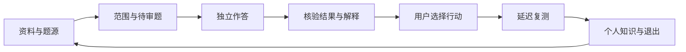

# 小驴考试 · 总体设计与信息架构

> 设计版本：v4，2026-10-02。本文描述目标体验，不证明插件已经实现。
> 定位及实施范围以 [待办融合与分阶段执行规划](19-待办融合与分阶段执行规划.md) 为准；稳定需求归属见 [全量归并索引](20-全量待办归并索引.md)。逐场景规范见 [UI 原型与交互规范](11-UI原型与交互规范.md)，视觉规则见 [视觉设计规范](12-视觉设计规范.md)，资产与评审入口见 [设计套件总册](13-UI设计套件总册.md)。

## 1. 产品承诺与使用目的

小驴考试定位为 **AI 贯穿的本地可验证备考工作台**，面向已经使用思源笔记的自主备考者。用户最终要在有限时间内识别学习缺口、选择下一行动、通过独立和延迟复测确认效果，并留下可继续使用的个人知识资产。

资料查看、题库整理、作答、模考、复盘与 AI 协作服务同一条流程：

AI 在整理、命题、提示、讲解、错因假设、行动提案和笔记写回中就地提供帮助。用户确认、确定性判分、历史作答、来源许可与内核闪卡评级具有各自的责任；生成文字和即时答对均不能替代独立复测。

首条体验可以是一个原创大学课程小测和一段讲义。学校、CET/KET、法考、CPA、CFA 的配置继续保留，各自选一个合法样例验证题组、评分和版本差异；同时支持全部考种不是首条闭环的前置条件。

## 2. 六个主导航域与 15 个场景

场景 ID 是文档和原型中的稳定定位，不是插件路由接口。原型统一入口为 [本地交互原型](../design/prototype/index.html)，下表可直接定位场景。

| 主导航域 | 场景 | 解决的用户问题 |
|---|---|---|
| 首页 | [home 项目首页](../design/prototype/index.html#home)、[project 项目与考试配置](../design/prototype/index.html#project) | 我正在备考什么，今天继续哪件事，范围和条件是否清楚？ |
| 资料与题库 | [sources 资料题源](../design/prototype/index.html#sources)、[reader PDF/视频学习](../design/prototype/index.html#reader)、[import 导入校对](../design/prototype/index.html#import)、[bank 题库与作者](../design/prototype/index.html#bank) | 我的资料在哪里，允许怎样使用，如何变成可核验的题目？ |
| 学习与复测 | [practice 独立作答](../design/prototype/index.html#practice)、[review 复测与复习](../design/prototype/index.html#review) | 这次是否独立作答，之前的行动是否带来稳定改善？ |
| 模考 | [mock-setup 模考配置](../design/prototype/index.html#mock-setup)、[mock 严格模考](../design/prototype/index.html#mock) | 如何按明确规则演练，如何准确保存作答和计时？ |
| 证据与知识 | [debrief 复盘行动](../design/prototype/index.html#debrief)、[report 证据报告](../design/prototype/index.html#report)、[assets 知识资产/退出](../design/prototype/index.html#assets) | 哪些结论有证据，我接下来做什么，学习成果如何保留或迁移？ |
| AI任务 | [ai AI任务/审核](../design/prototype/index.html#ai) | AI 处理了什么，哪些结果还需审阅，如何安全应用？ |
| 全局工具入口 | [settings 设置与联动](../design/prototype/index.html#settings) | 模型、保存、显示和外部工具的当前能力与权限是什么？ |

主导航按用户目的组织。项目切换器和设置放在全局区域；设置不占第七个主导航域。来源、题目、会话和 AI 任务在相关场景中呈现同一对象状态，避免不同页面显示不同版本或不同保存结论。

块菜单、命令、Dock 和思源智能体属于进入同一任务的可选入口。进入时携带已选项目、题目或资料；目标不明时补选。返回时恢复来源页面、筛选、滚动位置和未完成会话，详情页保留“返回来源”及“回到学习”动作。

## 3. 三条优先用户旅程

### 3.1 首次获得可信结果

`home → project → sources/import → bank → practice → debrief`。

首次使用可选择原创演示、手工录题或自己的获准文件。先选择最小项目和目标题库，再预览、试导、读回；题源或答案未知时明确待补。提交后显示按声明规则得到的结果，再选择重做、补笔记或延迟复测。时间目标仅用于体验评审，不承诺所有用户五分钟完成。

### 3.2 从资料学习到知识沉淀

`sources → reader → ai → bank → practice → debrief → review → assets`。

PDF 原页或视频先能够打开、定位和记录个人笔记；这些动作先独立于 AI 成立。用户主动选择获准的文字片段、页或时间段，预览 AI 实际输入；生成候选进入审核，通过后才进入学习题库。视频文件名、网盘链接和识别结果分别标身份，不能假定模型已经看过原片。

复盘保存来源事实、AI 解释和用户反思三个层次，再约定后续复测。笔记和定位存入思源；外部原件登记稳定位置，获准复制时才将副本放入 assets。界面分别显示“仅记录位置”“已保存笔记”和“原件副本已保存”。

### 3.3 模考与考后行动

`mock-setup → mock → debrief → report → review/assets`。

开始前预览题量、时间、评分、媒体策略、可用资料和未答规则，冻结本次版本与条件。严格模考中本插件所有题目级 AI 入口执行相同禁用检查；交卷后才能讲解或复盘。报告呈现范围、样本和作答条件，用户据此选择行动；考后可归档项目、保留笔记或按目的迁移。

作者维护与发布沿 `sources/import → bank → ai → assets` 展开。个人作答与作者修订分开；题库换版显示影响，历史尝试继续引用原版本。题目作者承担内容核验，AI 审题提供待审证据和修改候选。

## 4. 共享责任与设计对象

采用已经存在的服务边界逐步补齐契约。设计不要求先创建通用 ModuleRegistry、五张扩展注册表或重写全部模块。一个最小产物、一种目标类型和一个已验证前端可先形成完整闭环。

| 责任 | 设计需要表达的对象与条件 | 工作包 |
|---|---|---|
| 项目与身份 | project、bank、qid/revision、attemptId、materialId/revision、locator；每个动作有明确目标 | W02 |
| 保存与恢复 | 当前草稿、提交结果、确认保存、部分成功、失败可恢复、执行结果未知 | W03 |
| 来源与用途 | 真实性、答案证据、版本、资源许可及外发范围分别记录 | W04、W22 |
| 题目与导入 | 原材料、映射、修订、人工审核和入库回执相互可回查 | W05、W06 |
| 会话与评分 | 条件快照、答案修订、暴露事件、用时；结构化答案按声明规则判分 | W08、W09 |
| 学习证据与行动 | 独立/受助、原题/迁移、即时/延迟、自评/客观分栏；缺失保留未知 | W10、W11、W12 |
| 资料与工具 | 原件位置、个人笔记、页/时间点与各工具能力分别表达 | W17、W18 |
| AI任务与应用 | task、模板版本、实际上下文、端点、结果状态、提案及应用回执 | W21、W22、W23 |
| 智能体入口 | 目标宿主注册/权限/effects/参数检查；调用普通 UI 使用的任务服务 | W24 |
| 导出与生态 | 私人备份、公开分享、个人打印及具体桥分别放行 | W19、W25 |

以上是目标设计对象，具体字段和 schema 的实现证据由 [AI模板规范](18-AI智能体与提示词模板规范.md)、TODO 与各工作包承接。原型中的状态切换是本地演示。

## 5. 跨场景的状态与边界

- **保存**：输入、提交、已确认保存分别展示。保存失败时保留草稿，提供重试或手工保留；退出和重载按对应会话规则处理。草稿清理由用户选择，不能因隐藏入口静默删除历史。
- **独立作答**：未提交、已受助、已揭示、已提交和严格模考有明确状态。请求提示产生帮助记录；正式揭示使用独立动作。未揭示请求的实际输入排除答案、解析、兄弟题和旧对话中的答案。
- **AI任务**：待补输入、待发送、处理中、部分成果、待审阅、取消、失败和执行结果未知各有行动。取消说明实际通道边界；迟到结果保留在原任务，不能覆盖当前题目或页面。
- **应用**：候选、预览、人工批准、实际应用和撤销回执分别表达。应用前重新检查目标、版本、许可和模式；用户关闭对话并不表示已经保存。
- **资料**：原件可访问、仅存外链、需重新定位、可用离线副本分别表达。页码或时间点失败时给手工定位，个人笔记仍可继续编辑。
- **报告**：真实规则得分、人工确认分、自评与 AI 推断分开。样本不足或证据缺失不填零；报告可解释本次范围，正式通过率或预测考分仍属另行研究。
- **权利**：用户上传内容，插件提供工具与流程。购买或公开可见不自动允许外发、改编、复制或分享；AI 改写不消除来源限制。演示仅使用原创或明确许可样例。

## 6. AI贯穿与内置模板

每个 AI 入口展示“处理目标、实际片段、允许动作、模型通道、预计用量、缺失输入”。模板按固定证据/权限约束、任务正文、考试域叠层及表达偏好组合；缺 rubric、音频或年度信息时给补齐或简化路径。

优先承接 [docs/18](18-AI智能体与提示词模板规范.md) 中的资料整理、命题与独立审题、非答案提示、提交后讲解、错因假设、知识写回和片段学习任务。普通 UI 与思源智能体共享产物和回执；智能体实际宿主能力验证独立推进，不能将接口设计当作已经接入。

AI 结果必须标明引用、缺口及待审状态。审题的两阶段失败、冲突或证据不足均保留待审；模型自报 confidence 仅作诊断信号。收费取决于实际端点与任务预算，界面不以积分限制用户配置的 AI 学习能力。

## 7. 分阶段选入与评审

| 阶段 | 本设计首先验证的体验 | 原型评审落点 |
|---|---|---|
| S0 校准 | 定位、场景和当前能力证据分开 | home、project；原型使用范围标签 |
| S1 可靠地基 | 导入读回、正确作答、保存恢复及共享权限/模式契约 | import、bank、practice、mock-setup、mock、settings |
| S2 基础资料与AI | 无额外插件的资料查看/笔记；一条获准片段的 AI 候选到复盘流程 | sources、reader、ai、debrief；复测作为后续独立验证 |
| S3 备考深化 | 分钟容量、报告口径、延迟复测、个人知识保留与公开质量 | home、review、report、assets |
| S4 条件扩展 | 更多考试配置、格式、模态、授权 API、协作和公开桥 | 只扩展已选场景中的对应能力状态 |

各阶段选择最小子集，未选功能继续保持规划状态。实际验收范围与稳定编号以 [docs/19](19-待办融合与分阶段执行规划.md) 和 [docs/20](20-全量待办归并索引.md) 为准；15 个设计场景不是 15 项必须同时开发的任务。

## 8. 原型范围

v4 原型使用本地原创示例，演示导航、条件选择、状态和人工审核等交互。它不调用模型、真实文件 API、系统播放器、网盘或插件接口，也不保存真实学习记录。演示用模拟任务和保存回执必须标注“模拟”；目标服务、 schema 和智能体注册需后续实现与真实验收。
